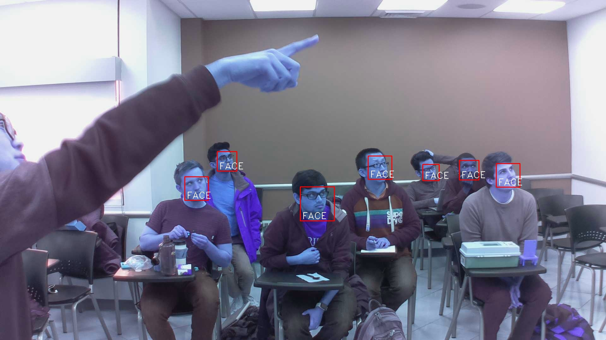
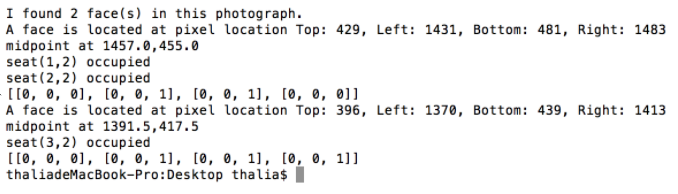
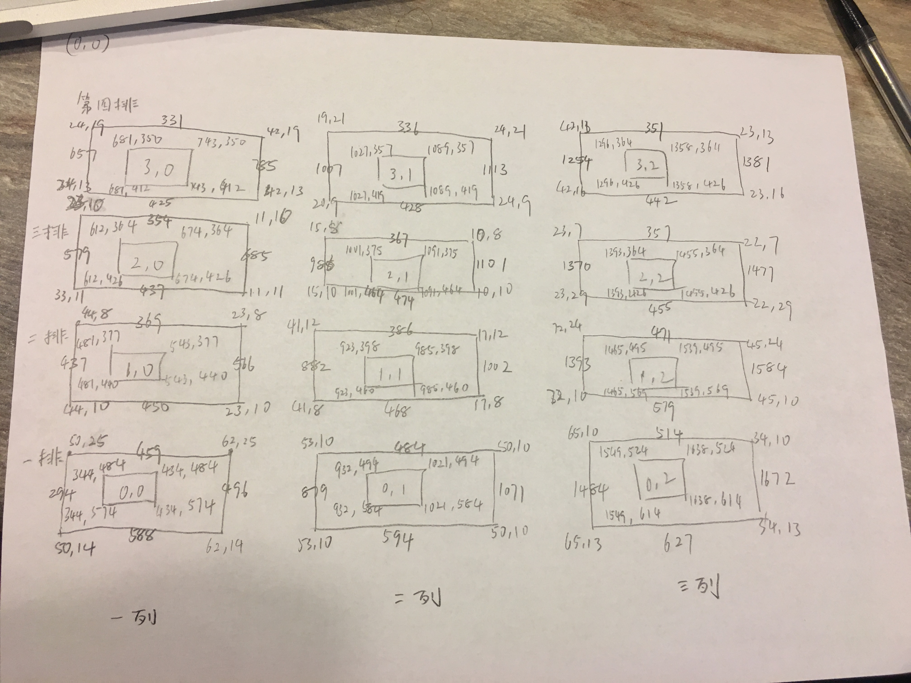

# Indoor_human_monitoring_System
Human monitoring system is an important technology to various services for individuals, especially indoor scenarios. In this paper, we proposed a static indoor human monitoring system consisting of two main systems: A Raspberry Pi web camera based image capturing system, which can transfer full quality images through AWS IoT service, and an image processing system in which face-recognition and face localization algorithms eventually calculate human locations in an indoor environment.

The image capturing system includes a Raspberry Pi web camera which is registered on the AWS IoT console. The AWS IoT establishes a connection between Web camera and processing back-end server. In order to provide a full-quality image transferring service, we develop a partitioned image transferring algorithm based on Mqtt message service.

Within the image processing system, we developed a face-recognition system based on a open-source deep learning model. Combined with a static face voting system, we eventually generate location matrix for each image.

Based on location matrix generated by image capturing system and image processing system mentioned above, our website is able to come up with a location graph, explicitly indicates human distribution in a certain place.

There are three parts in this project:
    Image capturing
        publisher/Periodically_Camera_Capture.py
        publisher/publisher.py  (compressed method)
        publisher/publisher_divide.py  (partitioned transmission method)

    Image Processing
        subscriber/subscriber_divide.py (partitioned transmission method)
        subscriber/subscriber.py (compressed method)
        face_recognition/faceCount.py (face recognition & localization)

In Raspberry Pi & Webcam side:
    
    Configuration:
        you need to install AWSIoTSDK python: https://github.com/aws/aws-iot-device-sdk-python
            pip install AWSIoTPythonSDK

        you need to install opencv: https://askubuntu.com/questions/783956/how-to-install-opencv-3-1-for-python-3-5-on-ubuntu-16-04-lts

    Execution:
        //Pre_requisite
        workon cv

        //running publisher.py only
        python publisher.py -e apj4uko2zpf4y.iot.us-west-2.amazonaws.com -r ../IoT_CERT/root-CA -c ../IoT_CERT/certificate.pem.crt -k ../IoT_CERT/private.pem.key -m publish -t aws/things/Image_broker_01/shadow/update -M "YES,YOU GOT IT"

        //running periodcally capture and publish procedure
        python2 Periodically_Camera_Capture.py -p 10 -t 2

In Serveer side:
    
    Configuration:
        you need to install face_recognition: https://github.com/ageitgey/face_recognition

        you need to install AWSIoTSDK python: https://github.com/aws/aws-iot-device-sdk-python
            pip install AWSIoTPythonSDK

    Execution:
        //running subscriber.py only and store into local file system
    
        python3 subscriber.py -e apj4uko2zpf4y.iot.us-west-2.amazonaws.com -r ../IoT_CERT/root-CA -k ../IoT_CERT/private.pem.key -c ../IoT_CERT/certificate.pem.crt -t aws/things/Image_broker_01/shadow/update

